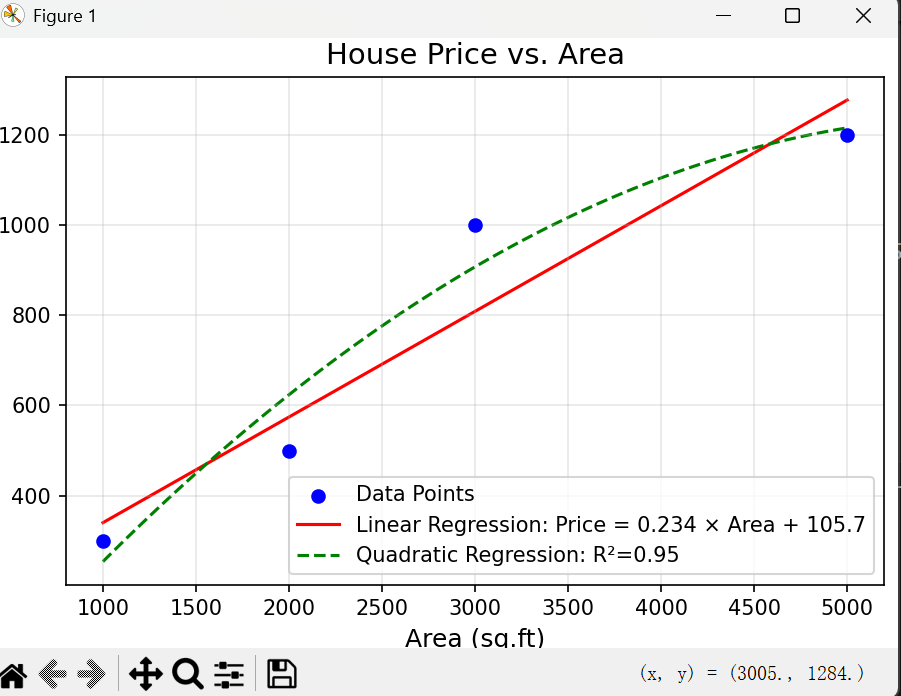

# 📌 Housing Price Predictor

## 🧑‍🤝‍🧑 Class 1 Team B
- 王泳博（Laurence Wang）
- 王泽华（Zehua Wang）
- 朱浩东（Adam Zhu）

## 📖 Project Description
A regression model that predict the housing price based on its areas. The model will firstly take some data inputs from users, then predict the best curve of prediction.

- The model will do both linear regression and quadratic regression.

## 🖼️ Screenshot

---

© 2025 Class 1 Team B. All rights reserved.
This project was created as part of the Honor Computer Science course, 2025 Spring at AP Division Shenghua Zizhu Academy.

