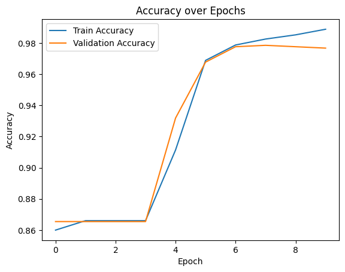

# 📌 Spam SMS Detection Model

## 🧑‍🤝‍🧑 Class 1 Team X
- 徐翊程（Curry Xu）
- 严粒（Light Yan）

## 📖 Project Description
A neural network model using Tensorflow to detect whether a SMS is a spam or ham. It is trained on a dataset with a size of 5000 sms. Validation Accuracy reaches 97.7%.

## 🖼️ Screenshot

---

© 2025 Class 1 Team X. All rights reserved.
This project was created as part of the Honor Computer Science course, 2025 Spring at AP Division Shenghua Zizhu Academy.

