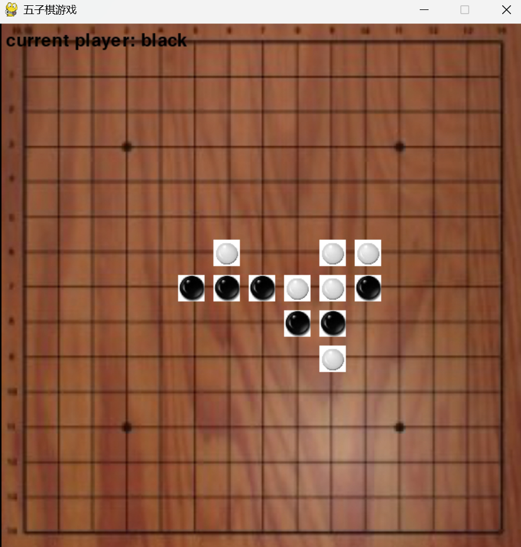

# 📌 五子棋

## 🧑‍🤝‍🧑 Class 1 Team C
- 李泽昊（Xavier）
- 潘乐峻（Kipper Pan）
- 沈祺（Mirko Shen）
- 余鹏年（Johnson Yu）

## 📖 Project Description
- **Notice: Game will restart immediately whenever a player wins!**

A classic 五子棋 game. Just use mouse cursor to play!

## 🖼️ Screenshot

---

© 2025 Class 1 Team C. All rights reserved.
This project was created as part of the Honor Computer Science course, 2025 Spring at AP Division Shenghua Zizhu Academy.

