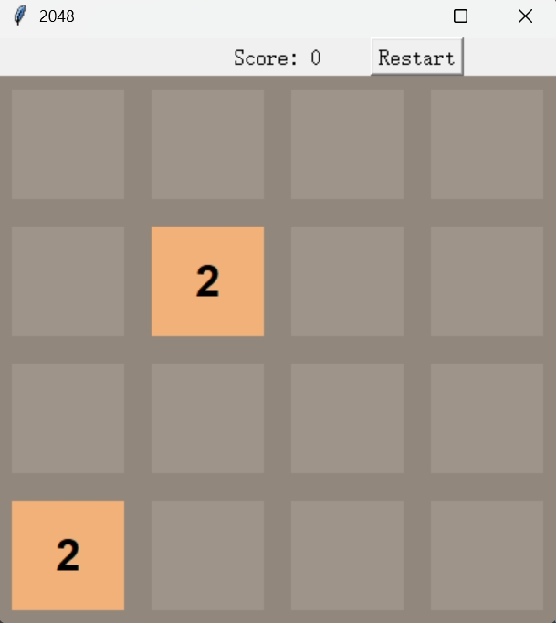

# 📌 2048

## 🧑‍🤝‍🧑 Class 2 Team K
- 蔡杭希（Tracy Cai ）
- 范思哲（Stacy Fan）
- 冯昊琳（Jutta Feng）
- 刘栩彤（Dora Liu ）
- 张珩（Vicky Zhang）

## 📖 Project Description
2048 is a simple and classic game that the goal is to merge numbers to get 2048. Only the same numbers can be merged. The player will lose if all cells are occupied by numbers. Tkinter is used instead of pygame.

## 🖼️ Screenshot

---

© 2025 Class 2 Team K. All rights reserved.
This project was created as part of the Honor Computer Science course, 2025 Spring at AP Division Shenghua Zizhu Academy.

