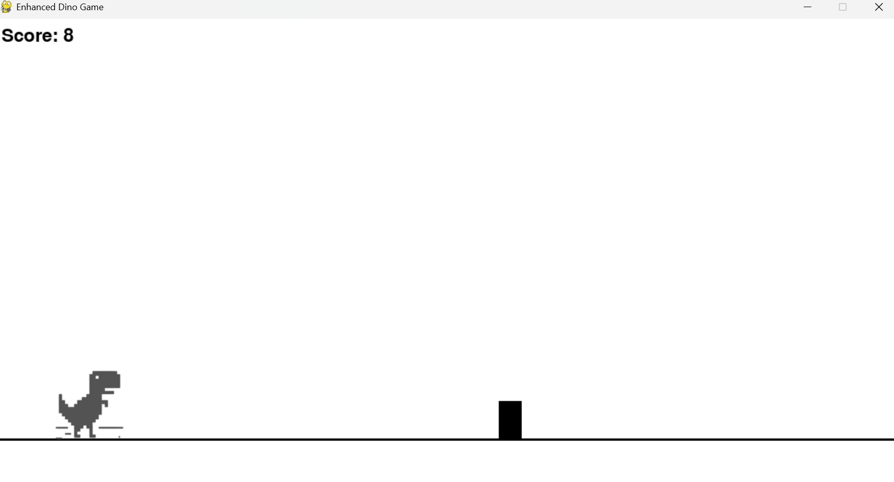

# 📌 Dino Hop

## 🧑‍🤝‍🧑 Class 2 Team S
- 蔡佶轩（Kimi Cai）
- 李以恒（Alex Li）
- 吴煜宸（Barry Wu）
- 邢震宇（Rain Xing）
- 章文馨（Gloria Zhang）

## 📖 Project Description
A pygame version of Chrome T-Rex Dino game. Just use SPACE key to jump, and eat blue dots to jump hiiiiiiiigher！

## 🖼️ Screenshot

---

© 2025 Class 2 Team S. All rights reserved.
This project was created as part of the Honor Computer Science course, 2025 Spring at AP Division Shenghua Zizhu Academy.

