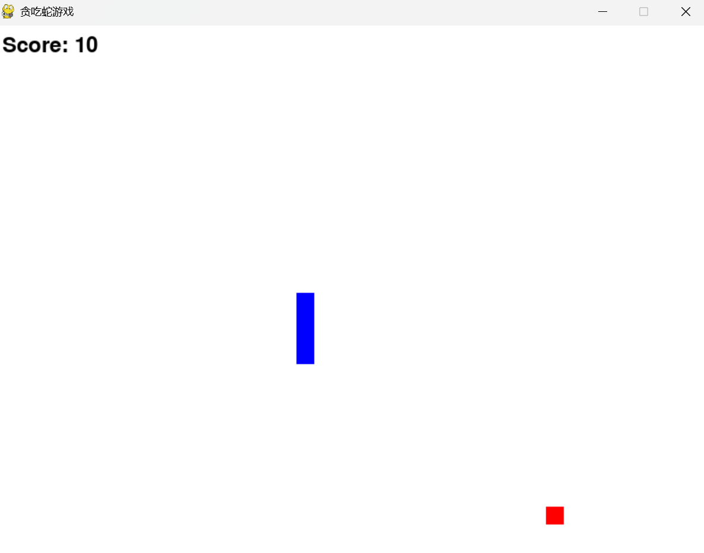

# 📌 Snake

## 🧑‍🤝‍🧑 Class 2 Team A
- 陈铭杰（Joel）
- 吴振轩（Ryan Wu）
- 杨行之（yanzi）
- 张光亚（Steven Zhang）

## 📖 Project Description
A pygame version of classic Snake game! Use arrow keys to control the snake. Try to grow bigger!

## 🖼️ Screenshot

---

© 2025 Class 2 Team O. All rights reserved.
This project was created as part of the Honor Computer Science course, 2025 Spring at AP Division Shenghua Zizhu Academy.

