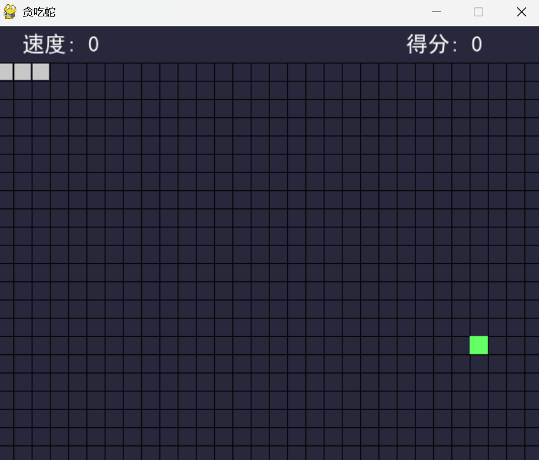

# 📌 Snake

## 🧑‍🤝‍🧑 Class 2 Team O
- 高意涵（Karina Gao）
- 刘芷怡（Lucy Liu）
- 魏翎芸（Lydia Wei）

## 📖 Project Description
A pygame version of classic Snake game! Use arrow keys to control the snake. Food with different color gives different scores!

## 🖼️ Screenshot

---

© 2025 Class 2 Team O. All rights reserved.
This project was created as part of the Honor Computer Science course, 2025 Spring at AP Division Shenghua Zizhu Academy.

