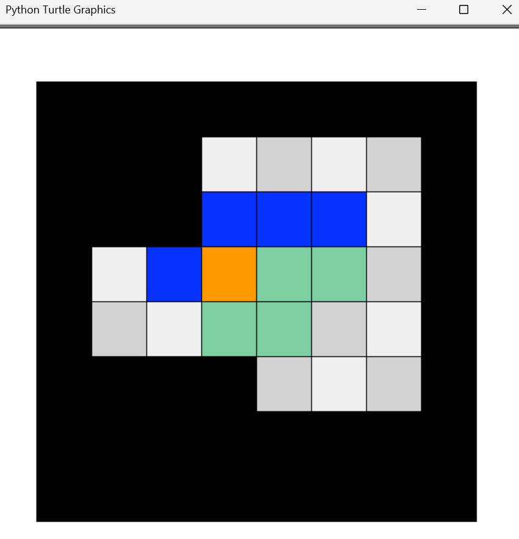

# 📌 Block Puzzle

## 🧑‍🤝‍🧑 Class 2 Team H
- 顾懿鑫（Hope Gu）
- 许非同（Fred Xu）

## 📖 Project Description
A Python turtle version of block puzzle game. Three levels in total.

## 🖼️ Screenshot

---

© 2025 Class 2 Team H. All rights reserved.
This project was created as part of the Honor Computer Science course, 2025 Spring at AP Division Shenghua Zizhu Academy.

